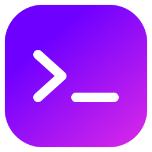

<p align="center">
  
</p>

<h1 align="center">Mekan Terminal</h1>

<p align="center">
  A modern, multi-project terminal manager for developers who juggle multiple repos, branches, and worktrees.
</p>

<p align="center">
  <a href="https://github.com/MekanYsmos-Software/mekan-terminal/releases/latest"></a>
  <a href="https://github.com/MekanYsmos-Software/mekan-terminal/releases/latest"></a>
  <a href="https://github.com/MekanYsmos-Software/mekan-terminal/blob/main/LICENSE"></a>
</p>

<br/>

<!-- Replace with an actual screenshot of the app -->
<p align="center">
  
</p>

---

## Why Mekan?

Switching between projects shouldn't mean losing your terminal context. Mekan keeps every project's terminals, layout, and git state organized in one place — no more juggling windows.

- **One app, all your projects.** Switch between repos instantly. Each project remembers its terminals, names, and working directories.
- **Git at a glance.** Branches, commits, worktrees, and open PRs — always visible in the sidebar.
- **Worktree-native.** Create, manage, and open terminals in git worktrees without leaving the app.
- **Auto-updates.** Install once, stay current. New releases are downloaded and applied automatically.

---

## Features

### Multi-Project Sidebar

Manage all your projects from a collapsible left panel. Add folders, reorder with drag-and-drop, set custom logos, and configure per-project server commands.

<!-- Replace with a screenshot of the sidebar -->
<p align="center">
  
</p>

### Terminal Grid

Up to **6 terminals per project**, auto-arranged in a responsive grid. Each terminal tracks its own shell, name, and working directory — all persisted across sessions.

Supported shells:
| Shell | Description |
|-------|-------------|
| **PowerShell** | pwsh 7+ with profile auto-loading |
| **CMD** | Windows command prompt |
| **WSL** | Windows Subsystem for Linux |

<!-- Replace with a screenshot of the terminal grid -->
<p align="center">
  
</p>

### Git Panel

A collapsible right sidebar with four live sections:

- **Branches** — local branches with ahead/behind indicators and dirty-state markers
- **Worktrees** — create, list, and remove worktrees; open terminals directly inside them
- **Commits** — last 10 commits with hash, author, date, and message (click to copy hash)
- **Pull Requests** — open GitHub PRs via `gh` CLI, click to open in browser

<!-- Replace with a screenshot of the git panel -->
<p align="center">
  
</p>

### Server Terminals

Configure a server command per project (e.g. `npm run dev`). Start, stop, and monitor it from a dedicated popup — separate from your regular terminals.

### Auto-Update

Mekan checks for updates on launch. When a new version is ready, it downloads in the background and prompts you to restart — no manual downloads needed.

---

## Keyboard Shortcuts

| Shortcut | Action |
|----------|--------|
| `Ctrl+C` | Copy selected text |
| `Ctrl+V` | Paste from clipboard |
| `Ctrl+Enter` | Insert newline |
| `Ctrl+F` | Search terminal output |
| `Enter` | Next search result |
| `Shift+Enter` | Previous search result |
| `Escape` | Close search |

---

## Installation

Download the latest installer from [**Releases**](https://github.com/MekanYsmos-Software/mekan-terminal/releases/latest) and run it. The app auto-updates after that.

### Prerequisites

- **Windows 10/11** (x64)
- [**GitHub CLI**](https://cli.github.com/) (`gh`) — optional, for Pull Requests section

---

## Development

```bash
# Install dependencies
npm install

# Run in development mode
npm run dev

# Build for production
npm run package
```

> **Note:** Building locally requires [Visual Studio Build Tools](https://visualstudio.microsoft.com/visual-cpp-build-tools/) with the "Desktop development with C++" workload (needed by `node-pty`).

---

## Tech Stack

| Layer | Technology |
|-------|-----------|
| Framework | Electron 33 |
| Frontend | React 19, TypeScript, Tailwind CSS |
| Terminal | xterm.js 5 + Fit, Search, WebLinks addons |
| State | Zustand |
| Build | Vite, electron-builder |
| PTY | node-pty |
| Git | simple-git, GitHub CLI |
| Updates | electron-updater |

---

## Releasing

Push a version tag to trigger a new release:

```bash
# Update version in package.json, then:
git tag v0.2.0
git push origin main --tags
```

GitHub Actions builds the installer and publishes it as a release. Existing installations pick up the update automatically.

---

## License

[MIT](LICENSE)

---

<p align="center">
  Built by <a href="https://github.com/MekanYsmos-Software">MekanYsmos Software</a>
</p>
